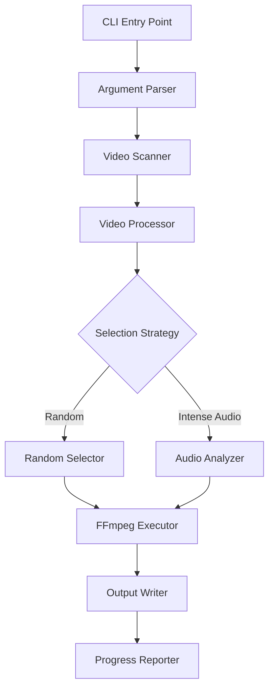

# Design Document: Video Clip Extractor

## Overview

The Video Clip Extractor is a Rust CLI application that recursively scans directories for video files and extracts short thematic clips. The tool leverages FFmpeg for video processing and provides configurable clip selection strategies (random or audio-based) to identify the most representative segments.

The architecture follows a pipeline pattern: directory scanning → video discovery → clip selection → extraction → output organization. The tool is designed for batch processing with progress reporting and robust error handling to ensure partial failures don't halt the entire operation.

**Key Design Decisions:**
- Use `std::process::Command` to invoke FFmpeg rather than FFI bindings for simplicity and portability
- Implement selection strategies as a trait to enable easy extension
- Process videos sequentially to avoid overwhelming system resources
- Use `clap` with derive macros for type-safe CLI argument parsing
- Output clips to `backdrops/backdrop.mp4` relative to source video location

## Architecture



### Component Responsibilities

1. **CLI Entry Point**: Initializes the application and orchestrates the workflow
2. **Argument Parser**: Validates and parses command-line arguments using `clap`
3. **Video Scanner**: Recursively discovers video files while respecting skip conditions
4. **Video Processor**: Coordinates the extraction pipeline for each video
5. **Selection Strategy**: Determines which segment to extract (trait-based design)
6. **FFmpeg Executor**: Constructs and executes FFmpeg commands
7. **Output Writer**: Manages output directory creation and file writing
8. **Progress Reporter**: Provides real-time feedback to the user

## Components and Interfaces

### CLI Configuration

```rust
use clap::Parser;

#[derive(Parser, Debug)]
#[command(name = "video-clip-extractor")]
#[command(about = "Extract thematic clips from video files", long_about = None)]
struct CliArgs {
    /// Directory path to scan for videos
    #[arg(value_name = "PATH")]
    directory: PathBuf,

    /// Clip selection strategy
    #[arg(short = 's', long = "strategy", value_enum, default_value = "random")]
    strategy: SelectionStrategy,

    /// Output resolution
    #[arg(short = 'r', long = "resolution", value_enum, default_value = "1080p")]
    resolution: Resolution,

    /// Include audio in output clip
    #[arg(short = 'a', long = "audio", default_value = "true")]
    include_audio: bool,
}

#[derive(Debug, Clone, clap::ValueEnum)]
enum SelectionStrategy {
    Random,
    IntenseAudio,
}

#[derive(Debug, Clone, clap::ValueEnum)]
enum Resolution {
    #[value(name = "720p")]
    Hd720,
    #[value(name = "1080p")]
    Hd1080,
}
```

### Video Scanner

```rust
struct VideoScanner {
    root_path: PathBuf,
}

impl VideoScanner {
    fn scan(&self) -> Result<Vec<VideoFile>, ScanError> {
        // Recursively walk directory tree
        // Filter for .mp4 and .mkv files
        // Skip directories with existing backdrops/backdrop.mp4
        // Return list of VideoFile structs
    }

    fn should_skip_directory(&self, dir: &Path) -> bool {
        // Check if backdrops/backdrop.mp4 exists
        dir.join("backdrops").join("backdrop.mp4").exists()
    }
}

struct VideoFile {
    path: PathBuf,
    parent_dir: PathBuf,
}
```

### Selection Strategy Trait

```rust
trait ClipSelector {
    fn select_segment(
        &self,
        video_path: &Path,
        duration: f64,
    ) -> Result<TimeRange, SelectionError>;
}

struct TimeRange {
    start_seconds: f64,
    duration_seconds: f64,
}

struct RandomSelector;

impl ClipSelector for RandomSelector {
    fn select_segment(
        &self,
        video_path: &Path,
        duration: f64,
    ) -> Result<TimeRange, SelectionError> {
        // Exclude first 60 seconds and last 240 seconds
        // Select random start time within valid range
        // Ensure clip duration fits (10-15 seconds)
        // Handle edge case: video too short for exclusions
    }
}

struct IntenseAudioSelector;

impl ClipSelector for IntenseAudioSelector {
    fn select_segment(
        &self,
        video_path: &Path,
        duration: f64,
    ) -> Result<TimeRange, SelectionError> {
        // Use FFmpeg ebur128 filter to analyze audio levels
        // Parse output to find loudest continuous segment
        // Fall back to middle segment if no audio track
        // Return time range of most intense audio
    }
}
```

### FFmpeg Executor

```rust
struct FFmpegExecutor {
    resolution: Resolution,
    include_audio: bool,
}

impl FFmpegExecutor {
    fn get_duration(&self, video_path: &Path) -> Result<f64, FFmpegError> {
        // Execute: ffprobe -v error -show_entries format=duration 
        //          -of default=noprint_wrappers=1:nokey=1 <video>
        // Parse output to f64
    }

    fn get_video_resolution(&self, video_path: &Path) -> Result<(u32, u32), FFmpegError> {
        // Execute: ffprobe -v error -select_streams v:0 
        //          -show_entries stream=width,height -of csv=s=x:p=0 <video>
        // Parse output to (width, height)
    }

    fn extract_clip(
        &self,
        video_path: &Path,
        time_range: &TimeRange,
        output_path: &Path,
    ) -> Result<(), FFmpegError> {
        // Build FFmpeg command with:
        // - Input file
        // - Start time (-ss)
        // - Duration (-t)
        // - Resolution scaling (if needed, no upscaling)
        // - Audio handling (-an if audio disabled)
        // - Output file
        // Execute command and capture stderr for errors
    }

    fn analyze_audio_intensity(
        &self,
        video_path: &Path,
        duration: f64,
    ) -> Result<Vec<AudioSegment>, FFmpegError> {
        // Execute: ffmpeg -i <video> -filter_complex ebur128=peak=true -f null -
        // Parse output to extract time and peak values
        // Group into segments and calculate RMS for each
        // Return sorted list of segments by intensity
    }

    fn build_extract_command(
        &self,
        video_path: &Path,
        time_range: &TimeRange,
        output_path: &Path,
        source_resolution: (u32, u32),
    ) -> Vec<String> {
        // Construct FFmpeg arguments:
        // ["ffmpeg", "-ss", start, "-i", input, "-t", duration, 
        //  "-vf", scale_filter, "-c:v", "libx264", "-preset", "fast",
        //  "-an" (if no audio), output]
    }

    fn calculate_scale_filter(
        &self,
        source_resolution: (u32, u32),
    ) -> Option<String> {
        // Determine target resolution based on self.resolution
        // Return None if source is smaller (no upscaling)
        // Return scale filter with letterboxing if needed:
        // "scale=1920:1080:force_original_aspect_ratio=decrease,pad=1920:1080:(ow-iw)/2:(oh-ih)/2"
    }
}

struct AudioSegment {
    start_time: f64,
    duration: f64,
    intensity: f64,
}
```

### Video Processor

```rust
struct VideoProcessor {
    selector: Box<dyn ClipSelector>,
    ffmpeg: FFmpegExecutor,
}

impl VideoProcessor {
    fn process_video(&self, video: &VideoFile) -> Result<ProcessResult, ProcessError> {
        // 1. Get video duration
        // 2. Select segment using strategy
        // 3. Create backdrops directory if needed
        // 4. Extract clip to backdrops/backdrop.mp4
        // 5. Return success/failure result
    }

    fn create_output_directory(&self, video: &VideoFile) -> Result<PathBuf, std::io::Error> {
        // Create backdrops subdirectory in video's parent directory
        let backdrops_dir = video.parent_dir.join("backdrops");
        std::fs::create_dir_all(&backdrops_dir)?;
        Ok(backdrops_dir.join("backdrop.mp4"))
    }
}

struct ProcessResult {
    video_path: PathBuf,
    output_path: PathBuf,
    success: bool,
    error_message: Option<String>,
}
```

### Progress Reporter

```rust
struct ProgressReporter {
    total: usize,
    current: usize,
    successful: usize,
    failed: usize,
}

impl ProgressReporter {
    fn start(&mut self, total: usize) {
        // Print: "Found {total} videos to process"
    }

    fn update(&mut self, result: &ProcessResult) {
        // Increment counters
        // Print: "[{current}/{total}] Processing: {video_path}"
        // Print: "  → Output: {output_path}" (if success)
        // Print: "  ✗ Error: {error}" (if failure)
    }

    fn finish(&self) {
        // Print summary:
        // "Completed: {successful} successful, {failed} failed"
    }
}
```

## Data Models

### Core Types

```rust
// Video file representation
struct VideoFile {
    path: PathBuf,           // Full path to video file
    parent_dir: PathBuf,     // Directory containing the video
}

// Time range for clip extraction
struct TimeRange {
    start_seconds: f64,      // Start time in seconds
    duration_seconds: f64,   // Duration in seconds (10-15)
}

// Audio analysis result
struct AudioSegment {
    start_time: f64,         // Segment start in seconds
    duration: f64,           // Segment duration
    intensity: f64,          // RMS or peak intensity value
}

// Processing result
struct ProcessResult {
    video_path: PathBuf,
    output_path: PathBuf,
    success: bool,
    error_message: Option<String>,
}
```

### Error Types

```rust
#[derive(Debug, thiserror::Error)]
enum AppError {
    #[error("Directory not found: {0}")]
    DirectoryNotFound(PathBuf),
    
    #[error("FFmpeg not found in PATH")]
    FFmpegNotFound,
    
    #[error("Scan error: {0}")]
    ScanError(#[from] ScanError),
    
    #[error("Process error: {0}")]
    ProcessError(#[from] ProcessError),
}

#[derive(Debug, thiserror::Error)]
enum FFmpegError {
    #[error("Failed to execute FFmpeg: {0}")]
    ExecutionFailed(String),
    
    #[error("Failed to parse FFmpeg output: {0}")]
    ParseError(String),
    
    #[error("Video has no audio track")]
    NoAudioTrack,
}

#[derive(Debug, thiserror::Error)]
enum SelectionError {
    #[error("Video too short: {0}s")]
    VideoTooShort(f64),
    
    #[error("Failed to analyze audio: {0}")]
    AudioAnalysisFailed(String),
}
```

## Correctness Properties

*A property is a characteristic or behavior that should hold true across all valid executions of a system—essentially, a formal statement about what the system should do. Properties serve as the bridge between human-readable specifications and machine-verifiable correctness guarantees.*


### Property 1: Recursive Directory Traversal
*For any* directory structure with nested subdirectories, the scanner should discover all subdirectories at any depth level.
**Validates: Requirements 1.1**

### Property 2: Video File Discovery
*For any* directory structure containing files with various extensions, the scanner should include all files with .mp4 or .mkv extensions in the processing list.
**Validates: Requirements 1.2, 1.3**

### Property 3: Skip Directories with Existing Clips
*For any* directory containing a backdrops/backdrop.mp4 file, the scanner should exclude all video files in that directory from the processing list.
**Validates: Requirements 1.4**

### Property 4: Non-Video File Filtering
*For any* directory structure containing files with non-video extensions, the scanner should exclude those files without raising errors.
**Validates: Requirements 1.5**

### Property 5: Extracted Clip Duration
*For any* video longer than 15 seconds, the extracted clip duration should be between 10 and 15 seconds inclusive.
**Validates: Requirements 2.1**

### Property 6: Output File Naming
*For any* processed video, the output file should always be named "backdrop.mp4".
**Validates: Requirements 2.3, 5.5**

### Property 7: No Upscaling
*For any* source video with resolution lower than the target resolution, the output resolution should match the source resolution (no upscaling should occur).
**Validates: Requirements 2.5, 2.6, 2.7**

### Property 8: Aspect Ratio Preservation
*For any* video that requires scaling, the output aspect ratio should either match the source aspect ratio or be letterboxed to fit the target resolution.
**Validates: Requirements 2.8**

### Property 9: Audio Inclusion Control
*For any* video with an audio track, the output should contain audio if and only if the audio inclusion flag is true.
**Validates: Requirements 2.9, 2.10**

### Property 10: Random Selection Valid Bounds
*For any* video processed with random selection strategy, the selected start time should be at least 1% of the video duration from the beginning and the end time (start + duration) should be at least 40% of the video duration before the video end, when the video is long enough to accommodate these exclusions.
**Validates: Requirements 3.1, 3.2, 3.3, 3.4**

### Property 11: Random Selection Variety
*For any* video processed multiple times with random selection, the start times should vary across runs (not always identical).
**Validates: Requirements 3.6**

### Property 12: Output Path Structure
*For any* processed video, the output path should be in a subdirectory named "backdrops" (lowercase) relative to the source video's parent directory, with filename "backdrop.mp4" (lowercase).
**Validates: Requirements 5.1, 5.4, 5.5**

### Property 13: Backdrops Directory Creation
*For any* video in a directory without an existing backdrops folder, the tool should create the backdrops directory before writing the output.
**Validates: Requirements 5.2**

### Property 14: Overwrite Existing Clips
*For any* video in a directory with an existing backdrops/backdrop.mp4 file, processing should replace the existing file with the new clip.
**Validates: Requirements 5.3**

### Property 15: Error Recovery Continuation
*For any* batch of videos where some fail to process, the tool should continue processing remaining videos and not halt on the first error.
**Validates: Requirements 7.2, 7.3**

### Property 16: Error Messages Include Paths
*For any* error that occurs during processing, the error message should include the file path of the video being processed.
**Validates: Requirements 7.5**

### Property 17: Progress Updates Per Video
*For any* batch of videos being processed, the tool should display a progress update for each video showing current count and total count.
**Validates: Requirements 8.2**

### Property 18: Success Messages Include Output Path
*For any* successfully processed video, the progress output should include the path where the theme clip was written.
**Validates: Requirements 8.3**

### Property 19: Duration Parsing Correctness
*For any* valid FFmpeg duration output (including fractional seconds), the parser should correctly convert it to a numeric value in seconds.
**Validates: Requirements 9.2, 9.4**

## Error Handling

### Error Categories

1. **User Input Errors**
   - Invalid directory path → Exit with error code 1 and clear message
   - Invalid CLI arguments → Display usage and exit with non-zero code

2. **Dependency Errors**
   - FFmpeg not found → Exit with error code 1 and installation instructions
   - FFmpeg execution failure → Log error, skip video, continue processing

3. **File System Errors**
   - Permission denied on directory → Log warning, skip directory, continue
   - Cannot create backdrop directory → Log error, skip video, continue
   - Disk space insufficient → Log error, skip video, continue

4. **Video Processing Errors**
   - Corrupted video file → Log error with path, skip video, continue
   - Duration detection failure → Log error with path, skip video, continue
   - Audio analysis failure (intense-audio mode) → Fall back to middle segment

### Error Handling Strategy

- **Fail Fast**: Exit immediately for user input errors and missing dependencies
- **Fail Gracefully**: Log errors and continue for individual video processing failures
- **Provide Context**: Always include file paths and specific error details in messages
- **Maintain Progress**: Track successful and failed operations for final summary

### Error Message Format

```
Error: <error-type>
File: <video-path>
Details: <specific-error-message>
```

## Testing Strategy

### Dual Testing Approach

The testing strategy employs both unit tests and property-based tests to ensure comprehensive coverage:

- **Unit Tests**: Verify specific examples, edge cases, and error conditions
- **Property Tests**: Verify universal properties across randomized inputs

Both approaches are complementary and necessary. Unit tests catch concrete bugs in specific scenarios, while property tests verify general correctness across a wide input space.

### Property-Based Testing

**Library**: Use `proptest` crate for property-based testing in Rust

**Configuration**: Each property test should run a minimum of 100 iterations to ensure adequate randomization coverage

**Test Tagging**: Each property test must include a comment referencing its design document property:
```rust
// Feature: video-clip-extractor, Property 2: Video File Discovery
#[proptest]
fn test_video_file_discovery(#[strategy(directory_structure())] dir: TempDir) {
    // Test implementation
}
```

**Property Test Coverage**:
- Directory scanning behavior (Properties 1-4)
- Clip extraction constraints (Properties 5-9)
- Selection strategy correctness (Properties 10-11)
- Output organization (Properties 12-14)
- Error handling (Properties 15-16)
- Progress reporting (Properties 17-18)
- Duration parsing (Property 19)

### Unit Testing

**Focus Areas**:
- CLI argument parsing with various flag combinations
- FFmpeg command construction for different scenarios
- Edge cases: very short videos, videos without audio, videos with unusual aspect ratios
- Error conditions: missing FFmpeg, corrupted videos, permission errors
- Fallback behavior: intense-audio mode with no audio track

**Example Unit Tests**:
```rust
#[test]
fn test_cli_defaults() {
    // Verify default values for optional arguments
}

#[test]
fn test_short_video_extraction() {
    // Verify videos < 5 seconds are extracted in full
}

#[test]
fn test_no_audio_fallback() {
    // Verify intense-audio mode falls back to middle segment
}

#[test]
fn test_ffmpeg_not_found() {
    // Verify appropriate error when FFmpeg is missing
}
```

### Integration Testing

**Approach**: Create end-to-end tests with real (small) video files to verify the complete pipeline

**Test Scenarios**:
- Process a directory tree with multiple videos
- Verify output files are created in correct locations
- Verify clips have correct duration and resolution
- Verify progress output is displayed
- Verify error recovery when one video fails

### Test Data Generation

For property tests, implement custom strategies using `proptest`:

```rust
// Generate random directory structures
fn directory_structure() -> impl Strategy<Value = TempDir> {
    // Create temp directories with random nesting and file types
}

// Generate random video metadata
fn video_metadata() -> impl Strategy<Value = VideoMetadata> {
    // Generate random durations, resolutions, audio presence
}

// Generate random time ranges
fn time_range(max_duration: f64) -> impl Strategy<Value = TimeRange> {
    // Generate valid time ranges within video duration
}
```

### Continuous Integration

- Run all tests on every commit
- Fail builds if any test fails
- Track test coverage (aim for >80% line coverage)
- Run property tests with increased iterations (1000+) in CI for thorough validation
